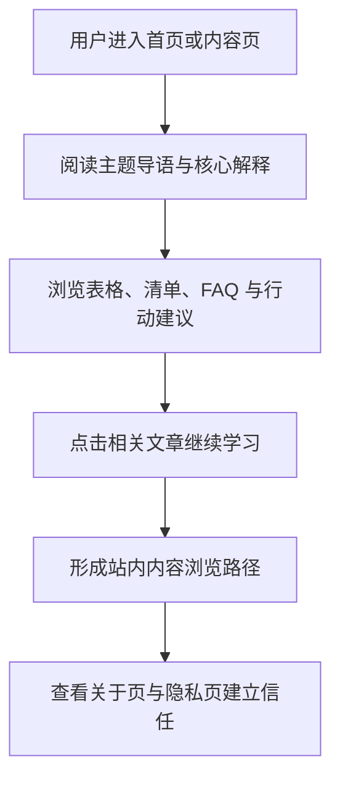

## 1. 产品概述

Personal Finance for Beginners Guide 是一个面向英语母语理财新手的纯静态内容网站，用最少术语、最强可读性解释预算、储蓄、信用、债务、投资、税务与基础账户体系。
- 目标是帮助 18-35 岁用户建立第一个可执行的财务健康习惯，并通过 Google AdSense 与 Amazon affiliate 形成内容变现闭环。
- 产品价值在于把高门槛的财务主题转化为低羞耻感、可立即行动、视觉友好的入门内容中心。

## 2. 核心功能

### 2.1 功能模块
1. **首页**：品牌主张、入门引导、10 篇主题文章卡片导航、起步建议、站点 FAQ。
2. **预算入门页**：解释预算方法、预算常见误区、工具推荐、立刻可做的一步。
3. **紧急备用金页**：说明作用、金额目标、存放位置、建立步骤。
4. **储蓄与投资对比页**：对比用途、风险、流动性、时间跨度，并可视化复利概念。
5. **信用分基础页**：解释分数区间、影响因素、提升方法、常见误解。
6. **债务管理页**：介绍雪球法、雪崩法、协商思路、债务心理建设。
7. **投资入门页**：用白话解释股票、债券、ETF、定投与风险边界。
8. **退休账户基础页**：解释 401(k)、Traditional IRA、Roth IRA 的核心区别与税务优势。
9. **税务入门页**：解释 W-2、1099、退税、deduction 与 credit 的差异和免费报税工具。
10. **保险入门页**：按优先级梳理健康、车险、租客险、人寿险是否需要。
11. **银行账户页**：解释 checking 与 savings 的不同使用方式及高收益储蓄账户。
12. **关于页**：介绍站点使命、编辑原则、内容边界与读者定位。
13. **隐私页**：广告、分析、affiliate 披露、第三方链接、信息使用说明。

### 2.2 页面详情
| 页面名称 | 模块名称 | 功能说明 |
|---|---|---|
| 首页 | Hero 区 | 展示站点标题、tagline、CTA、信任型视觉背景 |
| 首页 | 文章卡片区 | 以 3/2/1 响应式网格展示 10 篇内容入口与图标 |
| 首页 | 起步区 | 用最少步骤告诉新手先从哪里开始 |
| 首页 | FAQ 区 | 回答“从哪篇开始看”“是否需要很多钱”等问题 |
| 内容页 | 页面头图区 | 展示 H1、引语、主题背景图与阅读起点 |
| 内容页 | 核心正文区 | 通过 H2/H3、列表、表格、对比块解释主题 |
| 内容页 | 数据强调区 | 用等宽字体强调金额、百分比、时间跨度 |
| 内容页 | 行动区 | 给出“今天就能做的一步” |
| 内容页 | FAQ 区 | 处理 2-3 个常见误解，降低读者心理阻力 |
| 内容页 | 相关文章区 | 建立站内内容网络，避免孤立页面 |
| 关于页 | 使命说明区 | 解释站点为什么存在、适合谁阅读 |
| 关于页 | 编辑原则区 | 强调非评判、非投资承诺、通俗表达 |
| 隐私页 | 数据说明区 | 说明广告、分析、外链与 affiliate 披露 |
| 全站 | 固定导航 | 提供首页、文章入口、关于、隐私的可达性 |
| 全站 | 页脚 | 提供版权、导航、免责声明与快速链接 |

## 3. 核心流程

用户通常从搜索引擎进入首页或某篇文章，通过页面顶部导航与文末相关文章继续浏览，并在低压力、无术语堆砌的阅读体验中建立财务基础概念。首页承担总入口角色，内容页承担单主题讲透与交叉引导角色，关于页与隐私页承担品牌说明与合规支撑角色。

## 4. 用户界面设计

### 4.1 设计风格
- 主色：`#1B4F72`，用于导航、标题强调、结构边界，传达可靠和稳定。
- 辅色：`#27AE60`，用于链接、正向提示、增长语义。
- 强调色：`#F39C12`，用于 CTA 按钮、重点标签、少量亮点。
- 背景：`#F8FAFC`，保持页面干净、亮度柔和。
- 字体：标题使用 `Playfair Display`，正文与导航使用 `Inter`，数字与金额使用 `JetBrains Mono`。
- 布局：桌面优先，最大内容宽度 1100px；正文阅读宽度控制在 720px；采用卡片化信息组织。
- 图标：使用 Font Awesome Free 图标辅助理解，避免视觉噪音。
- 动效：克制使用，包含卡片轻微上浮、链接下划线展开、滚动渐入、导航缩小。

### 4.2 页面设计概览
| 页面名称 | 模块名称 | UI 元素 |
|---|---|---|
| 首页 | Hero 区 | 半透明渐变叠层、主题背景 SVG、双按钮 CTA、品牌标题 |
| 首页 | 文章卡片区 | 白色卡片、圆角、微阴影、图标、简短摘要 |
| 内容页 | 标题区 | 主题背景、标题、引语、阅读时间或关键词标签 |
| 内容页 | 正文区 | 长文排版、表格容器、引用框、步骤列表、提示卡 |
| 内容页 | CTA 区 | 高对比按钮、短操作指令、相关文章链接 |
| 关于页 | 介绍区 | 个人化但克制的品牌语气、内容边界与价值说明 |
| 隐私页 | 政策区 | 清晰分节、可扫描列表、简洁但完整的说明文字 |

### 4.3 响应式
- 采用桌面优先设计，再对平板与手机收缩栅格与间距。
- 文章卡片在桌面为 3 列、平板 2 列、手机 1 列。
- 表格在移动端必须支持横向滚动。
- 导航在小屏切换为折叠菜单，保证点击区域足够大。

### 4.4 背景图与氛围说明
- 每个页面使用独立的低透明度 SVG 背景图，通过伪元素叠加到页面容器中。
- 背景图透明度控制在 `0.08` 到 `0.15`，确保正文可读性优先。
- 视觉氛围偏“温和、可信、鼓励式”，避免金融行业常见的高压或炫技感。
- 首页背景侧重“选择与未来”，内容页背景则围绕各自主题做抽象线稿表达。
