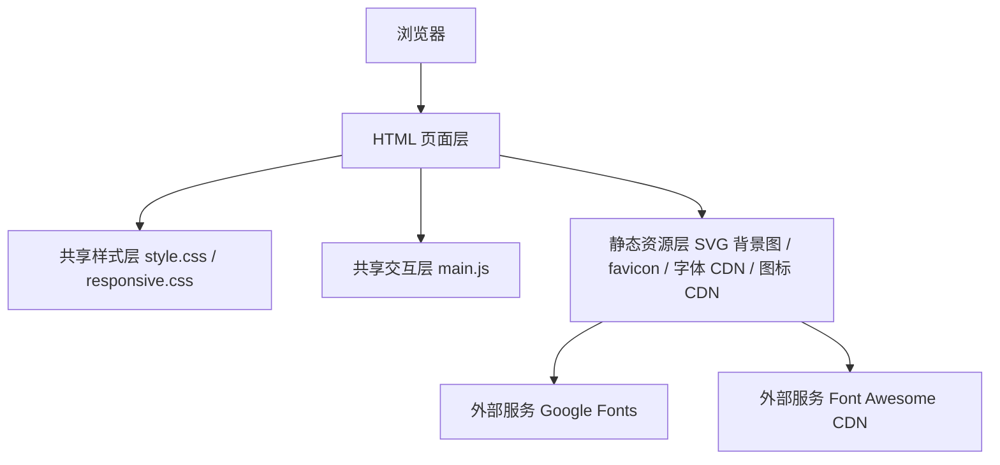

## 1. 架构设计

该项目采用纯静态前端架构，不包含后端、数据库或构建流程。所有页面均以独立 HTML 文件形式存在，共享统一 CSS 与原生 JavaScript，以降低部署复杂度并最大化 SEO 可见性。



## 2. 技术说明

- 前端：HTML5 + CSS3 + 原生 JavaScript（ES2020 以内）
- 页面类型：纯静态多页面站点
- 样式：`css/style.css` + `css/responsive.css`
- 交互：`js/main.js`
- 图标：Font Awesome 6 Free CDN
- 字体：Google Fonts 的 Playfair Display、Inter、JetBrains Mono，均使用 `display=swap`
- 背景图：本地 `images/bg/*.svg`
- 部署方式：任意静态托管平台，包括 Vercel、Netlify、GitHub Pages 或传统虚拟主机

## 3. 路由定义

| 路由 | 用途 |
|---|---|
| `/index.html` | 首页，汇总站点定位、文章入口与新手起步路径 |
| `/budgeting-101.html` | 预算入门指南 |
| `/emergency-fund.html` | 紧急备用金指南 |
| `/saving-vs-investing.html` | 储蓄与投资差异解释 |
| `/credit-score-basics.html` | 信用分基础说明 |
| `/debt-management.html` | 债务管理与还款方法 |
| `/investing-101.html` | 投资入门指南 |
| `/retirement-basics.html` | 退休账户解释 |
| `/tax-basics.html` | 税务入门说明 |
| `/insurance-101.html` | 保险入门与优先级 |
| `/bank-accounts.html` | Checking 与 Savings 账户使用方式 |
| `/about.html` | 站点介绍与编辑原则 |
| `/privacy.html` | 隐私政策、广告与 affiliate 披露 |

## 4. 目录结构

```text
personal-finance-beginners-guide/
├── index.html
├── budgeting-101.html
├── emergency-fund.html
├── saving-vs-investing.html
├── credit-score-basics.html
├── debt-management.html
├── investing-101.html
├── retirement-basics.html
├── tax-basics.html
├── insurance-101.html
├── bank-accounts.html
├── about.html
├── privacy.html
├── css/
│   ├── style.css
│   └── responsive.css
├── js/
│   └── main.js
├── images/
│   ├── bg/
│   │   ├── home-bg.svg
│   │   ├── budgeting-bg.svg
│   │   ├── emergency-bg.svg
│   │   ├── saving-bg.svg
│   │   ├── credit-bg.svg
│   │   ├── debt-bg.svg
│   │   ├── investing-bg.svg
│   │   ├── retirement-bg.svg
│   │   ├── tax-bg.svg
│   │   ├── insurance-bg.svg
│   │   └── bank-bg.svg
│   └── icon-placeholder.svg
├── favicon.ico
└── sitemap.xml
```

## 5. 页面骨架规范

所有 HTML 页面遵循统一骨架：

1. `head` 层包含独立 `title`、`description`、`keywords`、canonical 与 Open Graph 元信息。
2. 引入统一字体、图标、样式文件与脚本文件。
3. `body` 使用页面主题类，例如 `page-home`、`page-budgeting`，为背景图挂钩。
4. 固定头部导航包含首页、核心内容入口、关于与隐私页链接。
5. `main` 区按页面类型切换为首页模块或文章模块。
6. 页脚统一包含版权、快速导航与免责声明摘要。

## 6. 样式分层

### 6.1 `css/style.css`
- 定义设计令牌：颜色、阴影、圆角、间距、容器宽度、过渡时间。
- 定义全局排版与语义标签样式。
- 定义导航、按钮、卡片、文章模块、表格、FAQ、CTA、页脚组件。
- 定义滚动渐入和卡片 hover 的基础动画。
- 定义背景图容器和页面主题类。

### 6.2 `css/responsive.css`
- 处理平板断点 `768px - 1023px`。
- 处理手机断点 `< 768px`。
- 控制卡片网格从 3 列到 2 列再到 1 列。
- 调整标题字号、正文宽度、导航布局与表格滚动体验。

## 7. 脚本设计

`js/main.js` 使用原生 JavaScript，在 `DOMContentLoaded` 中初始化以下函数：

- `initStickyHeader()`：滚动时缩小导航高度。
- `initRevealOnScroll()`：为带 `data-reveal` 的块实现视口进入动画。
- `initMobileNavigation()`：处理移动端菜单开关。
- `setActiveNavigation()`：根据当前页面高亮对应链接。
- `enhanceTables()`：增强表格横向滚动容器体验。
- `initPage()`：统一初始化入口。

所有函数使用函数级注释；禁止使用 `eval()`、`document.write()`、内联 `onclick`。

## 8. 内容建模

每篇文章页遵循统一内容模板：

1. H1 标题
2. 引语段落
3. 4 个以上 H2 模块
4. 至少 1 个 H3 子模块
5. 至少 1 个表格或对比区
6. 行动建议区
7. 2-3 个 FAQ
8. 3 个以上相关文章内部链接

为提升复用性，HTML 结构保持字段与类名一致，例如：
- `.article-hero`
- `.article-body`
- `.callout`
- `.comparison-table`
- `.faq-list`
- `.next-steps`
- `.related-links`

## 9. SEO 规则

每个页面必须有以下独立字段：
- `<title>`
- `<meta name="description">`
- `<meta name="keywords">`
- `<link rel="canonical">`
- `og:title`
- `og:description`
- `og:type`
- `og:url`

`sitemap.xml` 必须包含全部 13 个页面。

在未提供正式域名时，使用占位域名：
`https://www.personalfinanceforbeginnersguide.com/`

## 10. 资源策略

- 所有背景图保存在 `images/bg/`，优先使用自绘 SVG。
- 背景图通过 CSS 伪元素挂载，透明度统一由 CSS 控制。
- 图标由 Font Awesome CDN 提供，避免本地冗余资源。
- 若首页不使用大图照片，则以渐变和 SVG 背景替代，降低性能成本。

## 11. 验证策略

实施完成后进行以下校验：

1. 检查 HTML 文件、SVG 文件、CSS 和 JS 文件是否全部存在。
2. 检查所有内部链接是否可达且文件名一致。
3. 检查每页 meta 标签是否完整。
4. 检查移动端菜单、滚动渐入、导航高亮是否正常。
5. 使用本地静态服务器预览，并抽查首页、至少 3 篇文章页、关于页、隐私页。
6. 对已编辑文件执行诊断检查并修复明显错误。
